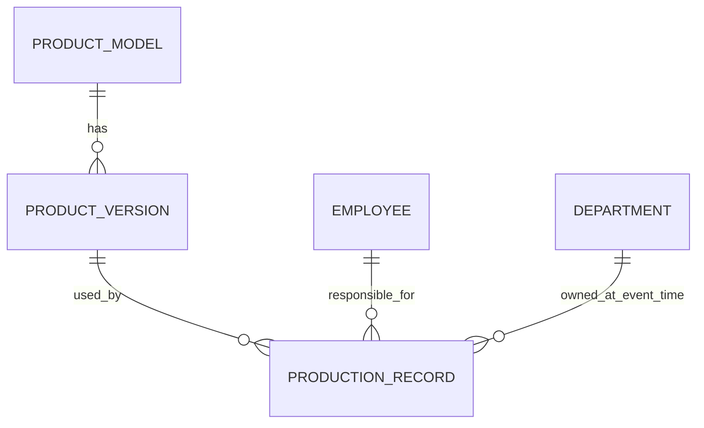

# Manufacturing Example: Product Version, Standard Workhour, and Historical Truth

This example demonstrates the intended `data-model-design` v0.2 output style.

## Context and decision provenance

A manufacturing system manages product models, product versions, standard workhours, and production records.

### FACT

- Product model `A01` exists.
- `A01` used version `V1` with a standard workhour of `20s`.
- On 2026-09-10, production switched to version `V2` with a standard workhour of `18s`.
- Production records are historical facts and must remain queryable.
- Employees can change departments.

### DECISION REQUIRED

- Must completed production preserve the exact standard workhour originally applied, or use a later corrected standard definition?
- Must reports show historical department labels or only preserve which department identity owned the production event?
- Can production be entered late or corrected backdated, and if so how is the department at the production date resolved?

### RECOMMENDATION

Do not decide the physical history mechanism until the business semantics above are approved.

## 1. Conceptual model



### Product Model

Represents a durable product identity such as `A01`.

### Product Version

Represents a specific business version of a product model, such as `V1` or `V2`. A version has its own lifecycle and must remain identifiable after it is no longer current.

### Standard Production Definition

The known standard fields are standard workhour, standard headcount, and target output. Whether these are simple attributes of ProductVersion or a separate effective-dated concept depends on whether they can change independently inside the same product version.

### Production Record

Represents a historical production event. It must preserve enough information to explain what happened at the **business-effective time**, not merely what was current when the row was inserted.

## 2. Logical model

### ProductModel

**Why this exists:** identifies the stable product family independent of version changes.

Lifecycle: created → active → retired.

### ProductVersion

**Why this exists:** one product model can have multiple versions, each with durable historical identity.

Why separate from ProductModel:

- cardinality is 1:N;
- versions change without changing product identity;
- historical production must keep the version actually used.

Important rule: `(product_model, version_code)` is unique.

### Standard definition

Do not create a separate `standard_workhour` table merely because a standard field exists.

Two valid models remain possible:

1. If standard values are immutable inside a product version, keep them as ProductVersion attributes.
2. If they can change independently and the old definition must remain reconstructable, introduce an effective-dated standard definition or an applied-value snapshot.

This is a business lifecycle decision, not a table-count preference.

### ProductionRecord

**Why this exists:** records a durable production fact.

It must identify the ProductVersion used.

#### Derived redundancy review

A tempting physical design is:

```text
production_record.product_id
production_record.product_version_id
```

But `product_version_id -> product_version.product_id` already determines the product.

Therefore `production_record.product_id` is transitively derivable.

Before storing both, review:

- Is the query benefit material?
- Can `product_id=A01` and `product_version_id` belonging to B01 ever be inserted?
- Which field is authoritative?
- Can the database enforce consistency?

For this example, the non-redundant baseline stores only `product_version_id` unless measured access patterns justify deliberate denormalization.

## 3. Physical model candidates

Because standard-history policy is unresolved, the physical model is intentionally not collapsed into one supposedly-final schema.

### Stable baseline

```text
product_model
- id PK
- model_code UNIQUE NOT NULL
- model_name

product_version
- id PK
- product_model_id FK NOT NULL
- version_code NOT NULL
- effective_from
- effective_to NULL
- UNIQUE(product_model_id, version_code)

production_record
- id PK
- production_date NOT NULL
- product_version_id FK NOT NULL
- quantity NOT NULL
- owner_user_id FK NOT NULL
- department_id FK NOT NULL   -- historical relationship identity, not full department-value snapshot
```

### BLOCKED BY D1 — standard history

If standard values are immutable within ProductVersion:

```text
product_version
- standard_workhour_seconds
- standard_headcount
- target_output
```

If standard values can change independently and past definitions must remain queryable:

```text
product_standard_definition
- id PK
- product_version_id FK
- effective_from
- effective_to
- standard_workhour_seconds
- standard_headcount
- target_output
```

If completed production must preserve exactly what was applied even after correction:

```text
production_record
- applied_standard_workhour_seconds
- applied_standard_headcount
- applied_target_output
```

These are alternative/possibly complementary strategies. Do not finalize them before D1 is answered.

## 4. Temporal review

| Fact / relationship | Can change? | Business-time expectation | Recording-time risk | Strategy |
|---|---|---|---|---|
| Product model name | Yes | Old production may intentionally show the latest name | Low | Current identity reference unless old label is required |
| Product version used | Yes/current version changes | Old production must remain V1 | Late entry may default to V2 if current-state logic is used | Version identity / effective-dated selection |
| Standard workhour | Yes/unknown | 9/1 may need the exact 20s originally applied | Current lookup may return a later corrected value | DECISION REQUIRED: snapshot or effective-dated history |
| Employee department | Yes | Production should belong to the department responsible on production date | Late entry after employee transfer may capture the wrong current department | Historical relationship reference, resolved at business-effective time |
| Department name | Yes | Business must decide whether old labels remain frozen | Joining current master data shows renamed label | Current identity reference or value snapshot/effective history depending policy |

Important terminology:

`production_record.department_id` preserves the **department relationship identity**. It is not a complete department snapshot if the historical screen still reads the current department name.

## 5. Scenario simulation

### Scenario A — version and standard mutation

1. 2026-09-01: `A01 / V1 / 20s` is effective.
2. 2026-09-05: white shift produces 500 units using V1.
3. 2026-09-10: `A01 / V2 / 18s` becomes effective.
4. 2026-10-15: someone changes or corrects the V1 standard from `20s` to `19s`.

Expected truth:

- the 2026-09-05 production must still identify V1;
- whether its efficiency basis remains 20s is **DECISION REQUIRED**.

If the production record stores only `product_version_id` and V1's standard is overwritten in place, old efficiency can silently change from 20s to 19s. That is a temporal failure if reports must reproduce the originally applied basis.

Result: **NEEDS DECISION**.

### Scenario B — business time vs recording time

1. 2026-09-01: Zhang belongs to Department A and performs production work.
2. 2026-09-05: Zhang transfers to Department B.
3. 2026-09-10: an administrator enters the September 1 production record late.

| Step | Business-effective time | System recording time |
|---|---|---|
| Production event | 2026-09-01 | 2026-09-10 |
| Department transfer | 2026-09-05 | 2026-09-05 |

Expected truth:

The September 1 production belongs to Department A if department reporting follows the organization responsible when production occurred.

A design that blindly copies Zhang's current department at insertion time stores Department B and is therefore **FAIL**.

The system needs a way to obtain/verify the department relationship at the production date, for example:

- effective-dated employee-department assignment history;
- explicit event-time department selection with validation;
- another authoritative historical source.

### Scenario C — contradictory derived redundancy

Assume a proposed row stores:

```text
product_id = A01
product_version_id = B01/V2
```

If both fields are stored and no compound integrity constraint exists, the row tells two contradictory stories.

Result: **FAIL** unless the duplication is deliberately justified and consistency can be enforced.

## 6. Human review gate

Before implementation, a human must decide at minimum:

1. Can standards change within the same product version?
2. If yes, must completed production use the original applied value or a later corrected definition?
3. Can production records be entered late/backdated?
4. How should event-time department ownership be resolved in that case?
5. Must historical reports preserve old department/product labels, or only stable identities?

Physical elements affected by unresolved decisions must remain marked as alternatives or blocked. The agent must not quietly select them simply to make the schema look complete.
