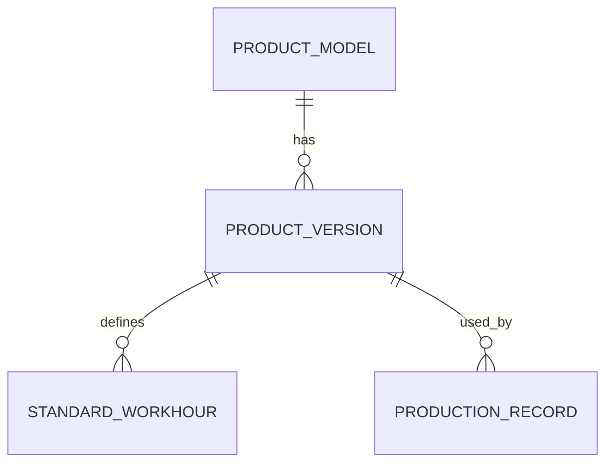

# Manufacturing Example: Product Version and Standard Workhour

This example demonstrates the intended `data-model-design` output style.

## Context

A manufacturing system manages product models, product versions, standard workhours, and production records.

Known facts:

- Product model `A01` exists.
- `A01` used version `V1` with a standard workhour of `20s`.
- On 2026-09-10, production switched to version `V2` with a standard workhour of `18s`.
- Historical production records must not be rewritten by later master-data changes.

Open question:

- Should a completed production record preserve only the product version used, or also snapshot the exact applied standard workhour? This depends on whether historical reports must reproduce the exact calculation basis even if the standard definition itself is corrected later.

## 1. Conceptual model



### Product Model

Represents a durable product identity such as `A01`.

### Product Version

Represents a specific business version of a product model, such as `V1` or `V2`. A version has its own lifecycle and must remain identifiable after it is no longer current.

### Standard Workhour

Represents a standard duration/rate applicable under a defined product version or effective definition.

### Production Record

Represents a historical production event. It must preserve enough information to explain what was produced and under which business definition.

## 2. Logical model

### ProductModel

**Why this exists:** identifies the stable product family independent of version changes.

Lifecycle: created → active → retired.

### ProductVersion

**Why this exists:** one product model can have multiple versions, each of which has durable historical identity.

Why separate from ProductModel:

- cardinality is 1:N;
- versions change without changing product identity;
- historical records must continue to reference the version actually used.

Lifecycle: draft → effective/current → superseded/retired.

Important rule: `(product_model, version_code)` must be unique.

### StandardWorkhour

**Why this exists:** standard workhour is a business definition that can differ between versions and may itself require history.

Potential designs:

1. If each product version has exactly one immutable standard workhour, it may be an attribute of ProductVersion.
2. If standard workhour can be revised independently or has an effective period, model it separately.

This decision should follow actual business behavior rather than table-count preference.

### ProductionRecord

**Why this exists:** records a durable production fact that must remain historically interpretable.

It references the ProductVersion used at production time.

Whether it also stores `applied_standard_workhour` depends on temporal policy.

## 3. Physical model

One reasonable relational baseline:

```text
product_model
- id PK
- model_code UNIQUE NOT NULL
- model_name

product_version
- id PK
- product_model_id FK NOT NULL
- version_code NOT NULL
- effective_from
- effective_to NULL
- UNIQUE(product_model_id, version_code)

standard_workhour
- id PK
- product_version_id FK NOT NULL
- seconds NOT NULL
- effective_from
- effective_to NULL

production_record
- id PK
- production_date NOT NULL
- product_version_id FK NOT NULL
- quantity NOT NULL
- applied_standard_workhour_seconds NULL  -- only if snapshot strategy is required
```

Notes:

- Do not add soft-delete columns by default. Superseded versions can remain historical records.
- Do not add generic `version` columns to every table unless concurrency or domain semantics require them.
- Indexes should follow actual queries, for example production date + product version if reports filter that way.

## 4. Temporal review

| Fact | Can change? | Historical expectation | Strategy | Reason |
|---|---|---|---|---|
| Product model name | Yes | Old production may normally show latest display name | Current reference, unless audit requires old label | Identity is more important than label |
| Product version | Yes/current version changes | Old production must keep V1 when V2 becomes current | Version identity / effective-dated history | Version changes business meaning |
| Standard workhour | Yes | Completed production may need to retain 20s | Snapshot or historical standard reference | Depends on reporting/calculation policy |

The unresolved standard-workhour choice is a human decision because it changes both schema and historical semantics.

## 5. Scenario simulation

### Event sequence

1. 2026-09-01: `A01 / V1 / 20s` is effective.
2. 2026-09-05: white shift produces 500 units using V1.
3. 2026-09-10: `A01 / V2 / 18s` becomes effective.
4. Later, someone corrects or edits the V1 standard-workhour master data.

### Expected business truth

The 2026-09-05 production record must still identify V1.

If historical efficiency calculations must reproduce the value actually applied on 2026-09-05, they must still use 20s even after later correction.

### Important records before the change

```text
product_model
1 | A01

product_version
101 | product_model=1 | V1 | 2026-09-01 | 2026-09-09
102 | product_model=1 | V2 | 2026-09-10 | NULL

standard_workhour
201 | version=101 | 20 | 2026-09-01 | ...
202 | version=102 | 18 | 2026-09-10 | ...

production_record
301 | 2026-09-05 | version=101 | qty=500 | applied_workhour=?
```

### Mutation test

Suppose V1's current standard-workhour row is overwritten from `20` to `19`.

If production_record stores only `product_version_id=101` and the standard row is mutable in place, the historical calculation may now return 19s. That would silently rewrite historical truth.

### Result

**NEEDS DECISION** until the business states whether completed production must preserve the exact applied workhour.

If yes, either:

- snapshot `applied_standard_workhour_seconds=20` on the production record; or
- make StandardWorkhour truly versioned/effective-dated and reference the exact historical standard identity.

Do not choose between those strategies merely for implementation convenience.

## Human review gate

Before implementation, a human must decide:

1. Can standard workhour be corrected after production has completed?
2. Must historical reports reproduce the originally applied value or the corrected definition?
3. Is a standard workhour immutable within a product version, or can it change independently?

Until those questions are answered, the schema is not fully ready for implementation.
