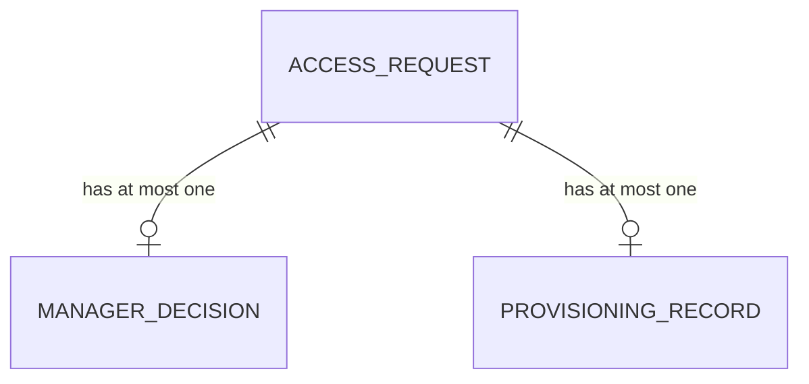

# Data Model — Internal Application Access Request

## Review status

**Ready for downstream technical design.** No material data-model decision remains unresolved. This is not implementation approval.

## 1. Context and provenance

### FACT

- One Access Request targets one application and one requested access level.
- One Manager Decision may exist per request.
- One Provisioning Record may exist per request.
- Rejected/cancelled requests cannot be provisioned.
- Provisioning grants the request's approved requested level unchanged.
- Manager decision actor/time/result and provisioning actor/time must be preserved.

### RECOMMENDATION

- Derive current request state from immutable business facts instead of storing a mutable `status` column in this small example.

### ASSUMPTION

- Actor ids and application codes reference external corporate systems; no local master tables are required for this scope.

### DECISION REQUIRED

None.

## 2. Conceptual model



### Access Request

Durable identity for the Employee's request. Owns requester, application, requested access level, reason, submission time, and optional cancellation fact.

### Manager Decision

Immutable approve/reject fact for one request.

### Provisioning Record

Immutable fact that IT granted access after approval.

## 3. Logical model

### access_request

- Identity: surrogate `id`.
- Attributes: requester, application code, requested access level, business reason, submitted time, optional cancelled time/by.
- Requested level is immutable after submission.
- No cross-time uniqueness on requester/application is imposed because the business did not require it.

### manager_decision

- Access Request 1 → 0..1 Manager Decision.
- Stores manager actor, decision time, and `APPROVE` / `REJECT`.
- Insert-only.
- Manager must not equal requester.

### provisioning_record

- Access Request 1 → 0..1 Provisioning Record.
- Stores IT actor and provisioned time.
- Insert-only.
- Does **not** duplicate application code or granted level: both are reached through the request, and the business rule says the granted level is exactly the approved requested level.

## 4. Physical model candidate

ANSI-flavored relational sketch:

```sql
CREATE TABLE access_request (
  id                     BIGINT PRIMARY KEY,
  requester_id           BIGINT NOT NULL,
  application_code       VARCHAR(100) NOT NULL,
  requested_access_level VARCHAR(20) NOT NULL
                           CHECK (requested_access_level IN ('READ', 'EDITOR')),
  business_reason        VARCHAR(1000) NOT NULL,
  submitted_at           TIMESTAMP NOT NULL,
  cancelled_at           TIMESTAMP NULL,
  cancelled_by           BIGINT NULL,
  CHECK (
    (cancelled_at IS NULL AND cancelled_by IS NULL)
    OR
    (cancelled_at IS NOT NULL AND cancelled_by IS NOT NULL)
  )
);

CREATE TABLE manager_decision (
  id                BIGINT PRIMARY KEY,
  access_request_id BIGINT NOT NULL UNIQUE REFERENCES access_request(id),
  decided_by        BIGINT NOT NULL,
  decided_at        TIMESTAMP NOT NULL,
  result            VARCHAR(10) NOT NULL
                    CHECK (result IN ('APPROVE', 'REJECT'))
);

CREATE TABLE provisioning_record (
  id                BIGINT PRIMARY KEY,
  access_request_id BIGINT NOT NULL UNIQUE REFERENCES access_request(id),
  provisioned_by    BIGINT NOT NULL,
  provisioned_at    TIMESTAMP NOT NULL
);
```

Application/transactional guards:

- cancellation only by the requester and only while no provisioning record exists and no final rejection exists;
- Manager decision only while the request is not cancelled and has no prior decision;
- `decided_by <> requester_id`;
- provisioning only when Manager decision is `APPROVE` and request is not cancelled;
- stale conditional writes fail rather than overwrite another final event.

The UNIQUE constraints provide a declarative backstop against duplicate Manager decisions and duplicate provisioning records.

## Dependency / redundancy review

| Candidate stored fact | Derivable from | Verdict |
|---|---|---|
| `provisioning_record.application_code` | provisioning → request | Do not store; transitive duplicate. |
| `provisioning_record.granted_access_level` | provisioning → request.requested_access_level | Do not store; business rule says they are identical, so a second value creates divergence risk. |
| `access_request.status` | cancellation + Manager Decision + Provisioning Record | Do not store in this compact example; derive current state. |
| Manager actor/time/result | not derivable from request | Store as immutable business fact. |
| Provisioning actor/time | not derivable from approval | Store as immutable business fact. |

No dual-path identity is retained: each child record identifies its request through one FK only.

## 5. Temporal review

| Fact | Business-effective time | Recording strategy |
|---|---|---|
| Request submitted | `submitted_at` | immutable |
| Manager decision | `decided_at` | immutable event row |
| Cancellation | `cancelled_at` | set once on request |
| Provisioning | `provisioned_at` | immutable event row |

No effective-dated master data or snapshots are needed because application catalogue history, access-level renames, and revocation are outside this example's scope.

## 6. Scenario simulation

### Normal

1. R-100 submitted for CRM / EDITOR.
2. Manager Decision D-1 inserts `APPROVE`.
3. IT inserts Provisioning Record P-1.
4. Current state derives to `FULFILLED`.
5. Historical query still shows who approved and who provisioned, with separate timestamps.

### Reachable stale-state race

1. R-101 is submitted.
2. Manager opens it.
3. Employee cancels R-101, setting cancellation facts.
4. Manager's stale Approve transaction re-checks preconditions and fails.
5. No Manager Decision row is inserted.

The model preserves one final business truth rather than allowing last-write-wins.

## 7. Design review

- Request, decision, and provisioning are separate because their identities/actors/times differ.
- No speculative application catalogue, revocation, recertification, or approval-chain tables are introduced.
- Cardinalities are explicit and backed by UNIQUE constraints.
- No duplicated granted-level field exists.
- No mutable generic status is required for correctness.
- History uses the actual business events rather than a generic audit table.
- No unresolved decision is embedded in the physical candidate.

## 8. Human review gate

**Ready for downstream technical design.**

The data model supports the resolved Business and UX behavior without introducing additional product semantics. Cross-artifact readiness and explicit human approval still remain separate gates.
